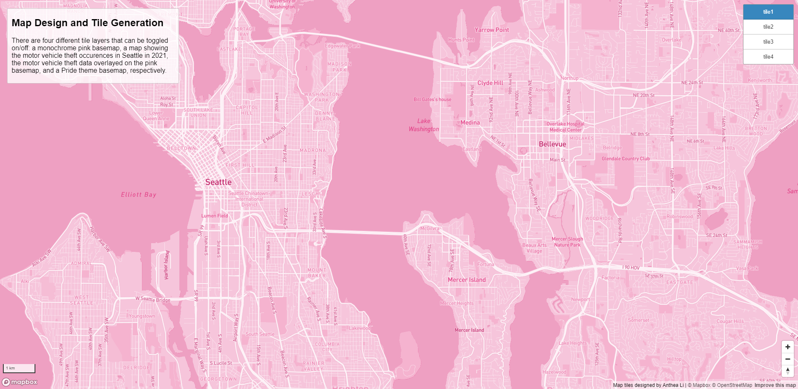
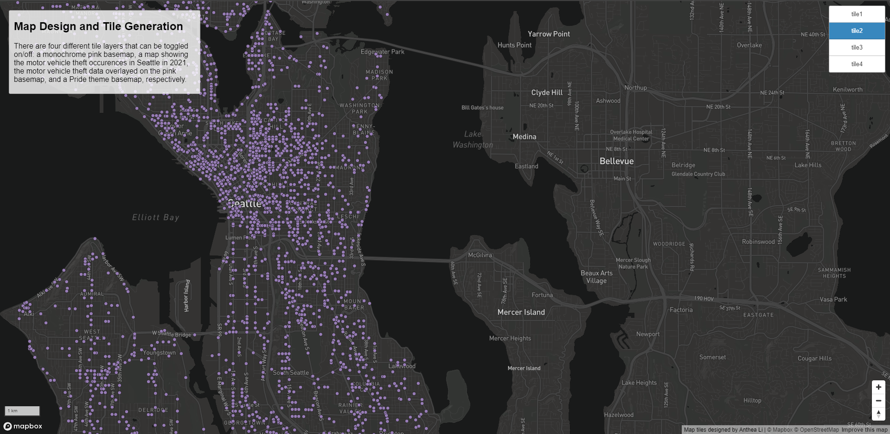
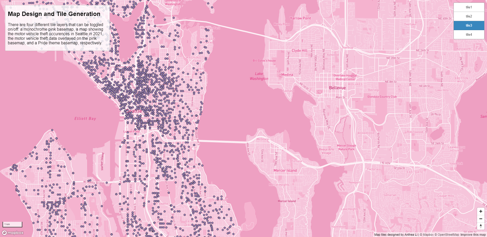
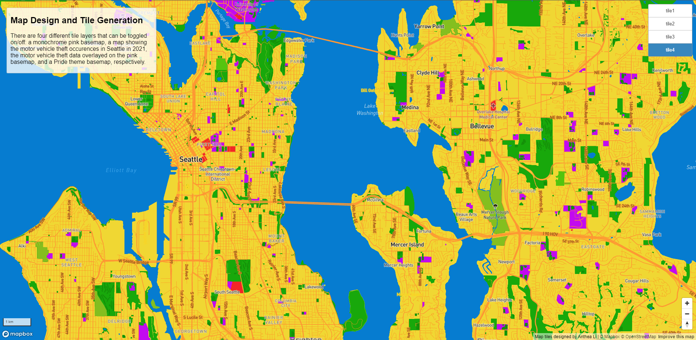

# GEOG 458 Lab 4
## Anthea Li
[Web map URL](https://anthealigeog.github.io/geog458lab4/)

The examined geographic area is the Seattle area.

### Layer 1: Pink monochrome basemap

Min zoom: 1, max zoom: 14
This tileset shows a plain pink monochrome basemap imported from MapBox.

### Layer 2: Motor vehicle theft occurrences in Seattle in 2021

Min zoom: 1, max zoom: 14
This tileset shows the locations of all the motor vehicle theft occurrences in Seattle in the year 2021.

### Layer 3: Motor vehicle theft data overlayed on pink basemap

Min zoom: 1, max zoom: 14
This tileset overlays the data used for Layer 2 on top of the pink basemap from Layer 1.

### Layer 4: Pride theme map

Min zoom: 1, max zoom: 14
This tileset is a Pride-themed basemap I designed via MapBox.